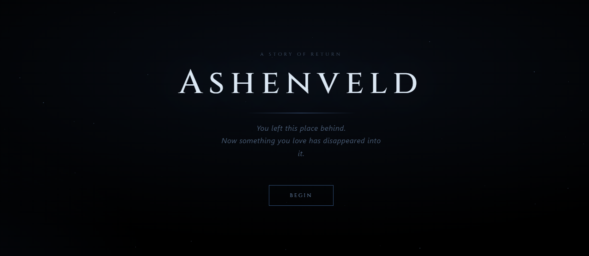
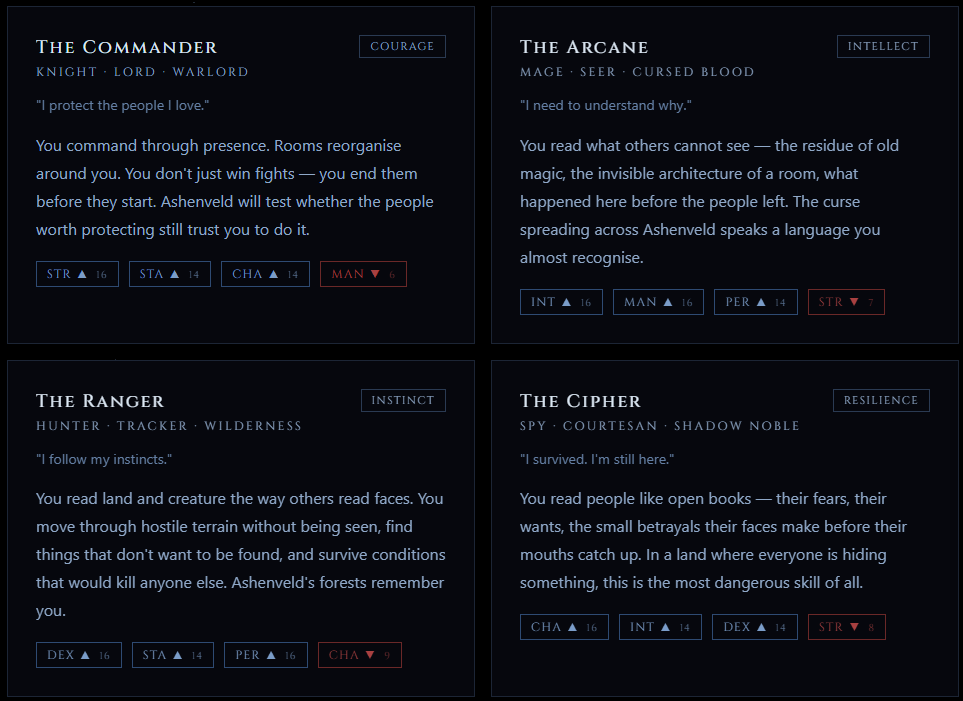
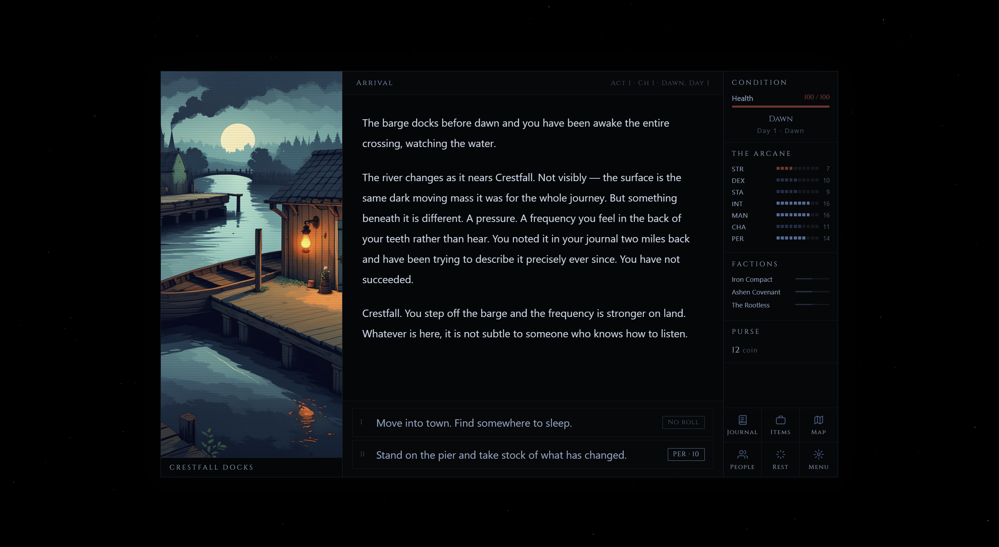

---

▶️ 🗡️ **[Play Ashenveld in your browser →](https://shiphrahx.github.io/Ashenveld/)**

# Ashenveld

Ashenveld is a web-based narrative RPG set in a cursed town and the ancient forest that is consuming it. It is a game about returning to a place you thought you were done with, and about what it costs to go looking for someone who may not want to be found.

---

## The World

The town of **Crestfall** was once an unremarkable river settlement — docks, a market square, an inn that kept the fire burning past midnight. That was eleven years ago. Now there is a checkpoint at the east gate. Half the market stalls are empty. The fountain in the square has not run in months. Someone left flowers at its base and no one has removed them.

To the east, the forest has always been there. But something changed in it. People who went in came back different, or did not come back at all. The affliction spreads slowly through Crestfall — not a plague, not a curse anyone can name cleanly. Just a diminishment. A becoming less.

You have come back because someone you love has gone into that forest and not returned.

---

## The Factions

Three powers are fighting over Crestfall's future, each certain they know what the town needs.

### The Iron Compact
A regional military authority that moved into Crestfall under the pretext of protection three years ago. They control the east gate, enforce a curfew, and track who goes where. Professionally courteous. Quietly authoritarian. Their commander is running out of patience with a situation his training did not prepare him for.

### The Ashen Covenant
A religious order that took over the old alderman's hall and hung a grey flag above the door. They offer comfort, purpose, and the certainty that the affliction can be purified — if the town allows it. Their oldest texts describe what is happening in Crestfall in precise detail. The priest who leads them here has read those texts. He believes in what he is doing anyway.

### The Rootless
People who have nowhere else to go — the afflicted, the displaced, those the Compact has pushed out of their homes and the Covenant has failed to save. They camp at the forest edge in fifteen tents around a central fire that never quite goes out. Their leader, Maret, has made arrangements to protect her people that she will not fully explain. She was the last person to see your missing person alive.

---

## The Classes

You choose who you are before you enter Crestfall. Four archetypes, each with different skills, different ways of reading a room, and different ways of being read by the people inside it.

- **Commander** — you have led people, and it shows
- **Arcane** — you understand things that should not be understandable
- **Ranger** — you move through difficult terrain without being noticed
- **Cipher** — you find what is hidden in what people say and what they do not

Your class shapes how scenes read, which choices are available to you, and how the dice favour you.

---

## The Characters

The people of Crestfall are not aligned with the factions that have claimed the town. Aldous runs the Tallow Inn and knows more than he says. Sen on the docks saw something in the river three weeks ago and has told no one. Corvin in the market has been there for eighty years and says exactly what he means. Wren, who used to be the person everyone liked, went to the forest edge six months ago and touched something and came back changed.

Everyone in Crestfall is waiting for something. Most of them are hoping you are not the one who makes it worse.

---

## Built With

- React 19 + TypeScript
- Vite
- CSS Modules

No additional runtime dependencies.
